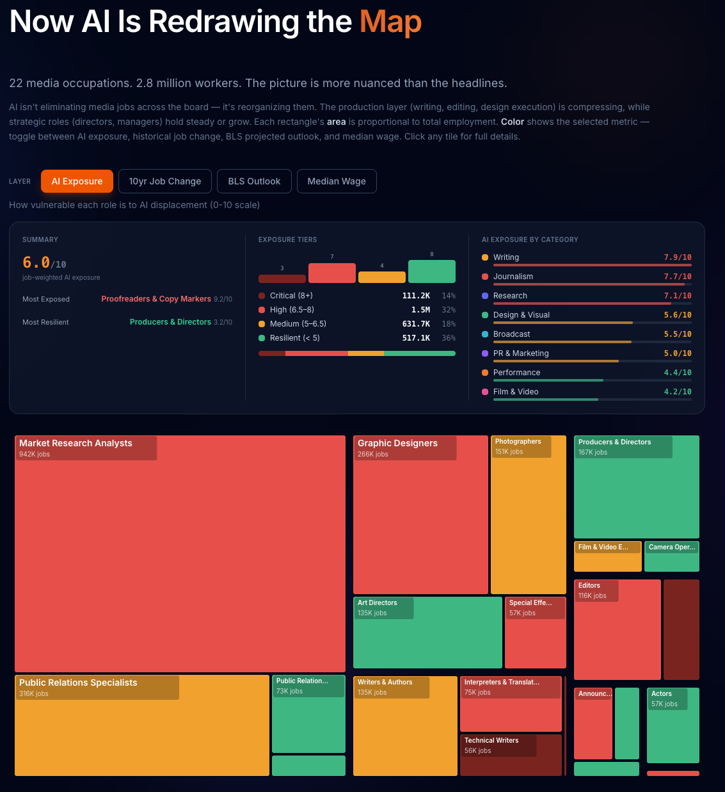

# The Media Displacement Index

**An open-source, interactive visualization mapping AI displacement risk across 22 media and communications occupations.**



**[See it live →](https://crestwood.digital/media-displacement-index)**

---

## What is this?

The Media Displacement Index maps 22 Bureau of Labor Statistics occupations — representing 2.8 million workers in media and communications — against four data layers:

- **AI Exposure** — a 0–10 score measuring how vulnerable each role is to AI displacement
- **10-Year Job Change** — actual employment change from 2013–2023
- **BLS Outlook** — projected change from 2023–2033 (BLS average ~4%)
- **Median Wage** — annual median wage for each occupation

Each occupation also includes a **Displacement Stack** (specific commercial AI products targeting that role), **education requirements**, and links to BLS source data with disclaimers where BLS combines occupations.

Inspired by [Andrej Karpathy's US Job Market Visualizer](https://github.com/karpathy/jobs).

## The Three-Act Structure

**Act I: The Collapse Already Happened.** Before AI wrote a single word, the media industry was already in free fall. A timeline showing two decades of decline — newspapers were the canary in the coal mine, but broadcast, publishing, and local media contracted across the board. 9 of 22 media roles were already declining before generative AI arrived.

**Act II: Now AI Is Redrawing the Map.** An interactive treemap sized by employment, colored by your chosen data layer. AI isn't eliminating media jobs across the board — it's reorganizing them. The production layer (writing, editing, design execution) is compressing, while strategic roles (directors, managers) hold steady or grow. Click any occupation for full details.

**Act III: Three Stories From the Data.** By combining AI exposure scores, 10-year employment change, and BLS projected outlook, three distinct patterns emerge:

- **The Decline Is Real** — Proofreaders, Reporters, Announcers, Survey Researchers. Negative on all three metrics. All signals point the same direction.
- **The Resilient** — Producers & Directors, PR Managers, Art Directors, Market Research Analysts. Growing with low AI exposure. The orchestrator can't be automated.
- **The Turnaround** — Photographers, Broadcast Technicians, Advertising Managers, Graphic Designers. Negative 10-year change but positive BLS outlook. The bleeding may have stopped.

## Data Sources

| Source | What it provides |
|--------|-----------------|
| [BLS Occupational Outlook Handbook](https://www.bls.gov/ooh/) | Employment (incl. self-employed), wages, 10-year projections (2023–2033) |
| [BLS Occupational Employment & Wage Statistics](https://www.bls.gov/oes/) | Granular employment by SOC code (May 2023) — used where OOH combines occupations |
| [Pew Research Center](https://www.pewresearch.org/topics/state-of-the-news-media/) | Media employment trends |
| [Northwestern Medill State of Local News 2024](https://localnewsinitiative.northwestern.edu/) | Local news decline data |

### Hybrid sourcing approach

Most occupations use OOH 2024 data (which includes self-employed workers). However, BLS combines some occupations on OOH pages — for example, "Advertising, Promotions, and Marketing Managers" lumps 434,000 jobs together. Where this happens, we use granular OES data by SOC code to isolate the media-specific role. Each affected occupation has a `blsNote` field explaining the sourcing. See `occupations.json` metadata for full details.

## AI Exposure Methodology

Each occupation was scored on a 0–10 AI Exposure scale by [Claude](https://claude.ai) (Anthropic) using a structured prompt that evaluates four factors:

1. **Output overlap** — Is the job's primary output something AI can produce? (text, translation, analysis, pattern recognition)
2. **Commercial products** — Do funded, shipping AI products already target this workflow?
3. **Verification difficulty** — How hard is it for a non-expert to verify AI output quality?
4. **Physical presence** — Does the job require being somewhere, touching something, or performing live?

The full scoring prompt is published in [`scoring-prompt.md`](scoring-prompt.md) so you can inspect, critique, or adapt it.

### Honest limitations

- These scores represent one model's judgment at one point in time. They are directional, not definitive.
- An LLM scoring LLM replaceability has an obvious self-referential bias.
- Exposure ≠ displacement — demand elasticity, regulation, and union contracts shape outcomes.
- "Writers & Authors" lumps novelists with SEO writers. BLS categories are coarse.
- AI capabilities are moving fast. A score of 4 today could be a 7 in 18 months.
- We publish the prompt precisely so you can disagree with us and do it better.

## Data Schema

Each occupation in `data/occupations.json` contains:

```
id, title, employment, medianWage, jobChange10yr, outlook10yr,
aiScore, aiRationale, blsUrl, blsNote?, education, category, displacers[]
```

The `blsNote` field appears on occupations where BLS combines roles on the OOH page, explaining the sourcing difference. The `education` field contains the BLS typical entry-level education requirement.

## Tech Stack

- [React](https://react.dev/) + [TypeScript](https://www.typescriptlang.org/)
- [D3.js](https://d3js.org/) (treemap layout)
- [Tailwind CSS](https://tailwindcss.com/) (styling)
- [Framer Motion](https://www.framer.com/motion/) (animations)

## Run Locally

```bash
git clone https://github.com/crestwood-digital/media-displacement-index.git
cd media-displacement-index
npm install
npm run dev
```

## Remix It

This project is designed to be forked and adapted. Here's how:

### Add or edit occupations
Edit `data/occupations.json`. Each occupation needs: `id`, `title`, `employment`, `medianWage`, `jobChange10yr`, `outlook10yr`, `aiScore`, `aiRationale`, `blsUrl`, `education`, `category`, and `displacers` array. Optionally add `blsNote` for sourcing disclaimers. The treemap, key panel, and tooltips adapt automatically.

### Update the AI scores
Copy the prompt from `scoring-prompt.md` into your preferred LLM. Feed it a BLS occupation description. Paste the score and rationale back into `occupations.json`.

### Adapt for a different industry
This is the one we're most excited about. The scoring framework is industry-agnostic. You could build:

- **Healthcare Displacement Index** — nurses, radiologists, medical coders, therapists
- **Legal Displacement Index** — paralegals, contract attorneys, compliance officers
- **Finance Displacement Index** — analysts, auditors, loan officers, traders
- **Education Displacement Index** — tutors, instructional designers, administrators

**To do it:**

1. Fork this repo
2. Replace the occupations in `data/occupations.json` with BLS occupations from your target industry
3. Update `data/categories.json` with your industry's natural groupings
4. Run each occupation through the scoring prompt (swap in your industry context)
5. Ship it

The visualization code doesn't care what industry the data represents. It reads the JSON and renders.

## License

[MIT](LICENSE) — do whatever you want with it.

## Credits

Built by [Crestwood Digital](https://crestwood.digital). Inspired by [Andrej Karpathy](https://karpathy.ai/).

Data from the [U.S. Bureau of Labor Statistics](https://www.bls.gov/). AI Exposure scores generated by [Claude](https://claude.ai) (Anthropic). Media decline data from [Pew Research Center](https://www.pewresearch.org/).

---

*If you build a version for your industry, we'd love to see it. Open an issue or tag [@chiragdshah](https://x.com/chiragdshah).*
